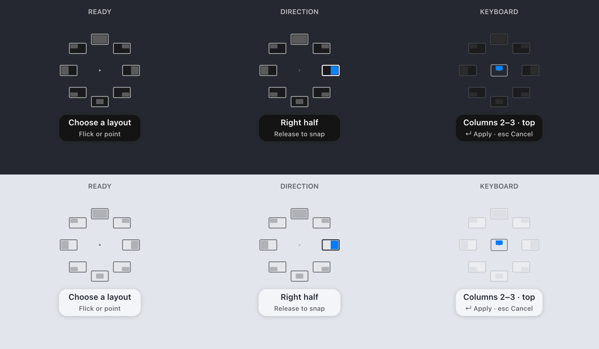

# Icon-only Ring

5 October 2026. This revision supersedes the segmented wheel and floating layout tiles in the earlier design reports.

## Design

- Bare window-layout icons, without a surrounding band, individual card backgrounds, per-icon labels or centre plate.
- Consistent proportions across displays. Subdued inactive destination fills; the selected destination gains the accent colour and a stronger outline.
- A tiny origin marker preserves the gesture anchor. Grid selection uses one unframed span glyph while the directional icons recede.
- A smaller caption names the action and offers only the relevant input guidance. Pointer selections read “Release to snap”; keyboard selections retain Apply and Cancel hints.
- Shortcut confirmations use a single layout glyph or checkmark rather than another miniature eight-part menu.

The settings, gesture thresholds, configured actions, visibility options and Reduce Motion behaviour remain supported. The optional point-boundary circle remains an explicit user setting and is off by default.

## Apple references

[Apple HIG: SF Symbols](https://developer.apple.com/design/human-interface-guidelines/sf-symbols) informed the use of consistent glyph treatment, opacity hierarchy and selected-state emphasis. [Apple HIG: Materials](https://developer.apple.com/design/human-interface-guidelines/materials) informed the restrained material treatment and legibility over desktop content. This is an independent interpretation; the layout glyphs are drawn with Core Graphics, not supplied Apple symbols.

## Verification

- 288 core tests passed across 19 suites.
- 131 production-layer rendering/geometry checks passed, including gesture-direction agreement, edge placement, overlapping-target checks and centre-preview visibility transitions.
- Native app build succeeded and the icon-only design was inspected in the running Settings preview.
- Physical hotkey feedback and live multi-display behaviour remain unverified.

The image is a production-layer render with opaque material stand-ins, not a desktop screenshot:

Build: `/Users/prabeshbhetwal/Library/Caches/tessera-build/dd-icon-ring-20261005/Build/Products/Debug/Tessera.app`.

Try Settings → Overlay → Show on Screen, then use the configured trigger over a movable window. Changes remain local and uncommitted.
